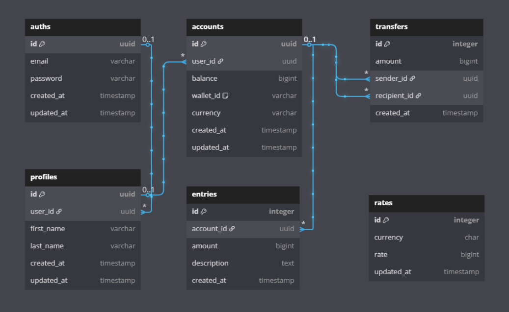

# demo-credit
A backend service that provides wallet functionality for a mobile lending application. The service handles account management, transfers, and transaction tracking.

## Features
- Account Creation and Management
- Money Transfers
- Transaction History
- Balance Enquiries
- Multiple Currency Support
- Unit tests

## Tech Stack
- **Runtime**: Node.js
- **Database**: MySQL
- **ORM**: Knex.js
- **Testing**: Jest
- **Containerization**: Docker
- **Language**: TypeScript

## Database Schema


## API Documenntation
[Postman Docs](https://documenter.getpostman.com/view/23824252/2sAYdoEnUT)

## Project Structure - Core entities
```
src/
├── internal/
│   ├── transactions/    # Database transaction handling
│   ├── models/          # Data models/entities
│   ├── queries/         # Database queries
│   ├── database.ts      # Database configuration and utilities
│   └── store.ts        # Orchestrates database operations and business transactions as a single provider.
├── utils/              # Utility functions
├── server.ts           # Application entry point
├── services/           # Application business logic
└── routes/             # Application API routes
```

## Setup

1. Clone the repository

2. Install dependencies:
```bash
   npm install
```
3. Set up environment variables:
```bash
   cp env.example .env
```

4. Run migrations: migrations are run automatically when the application is initialized or when `/src/db.ts` file is run as a standalone but migrations can also be run in isolation
```bash
   npm run migrate
```

## Running the Application

```bash
   npm run dev | npm run start:dev   # Development mode
   npm run build                     # Build project
   npm start                         # Production mode
```

## Testing

```bash
   npm run test
```
